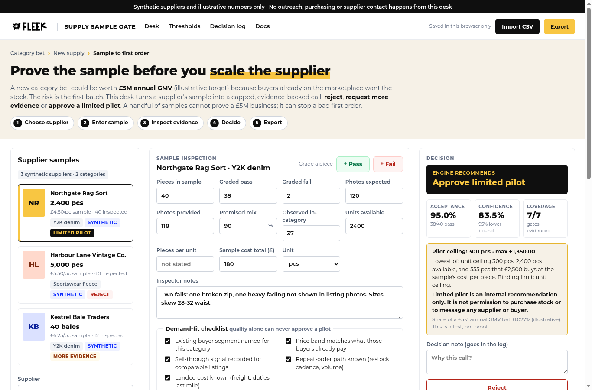

# Supply Sample Gate

**Independent concept by Ayomide Ahmed. Not an official Fleek product.** Synthetic suppliers and illustrative numbers only.

A sample-to-first-order decision desk for a category bet. An operator enters what a new supplier's sample actually showed, sees which of seven evidence gates pass, fail or are missing, and records one of three calls: **reject**, **request more evidence** or **approve a limited pilot**. A limited pilot is a capped internal recommendation. It is never permission to purchase stock or to message any supplier or buyer, and the app has no outreach of any kind.

Built for the problem described in Fleek's Special Projects Lead – Category Expansion role: category bets start with supply for buyers already on the marketplace, so the first supplier decision needs evidence, not a CRM.

- Live demo: _pending Cloudflare deployment (see [docs/DEPLOYMENT.md](docs/DEPLOYMENT.md))_
- Walkthrough video: [docs/video](docs/video)



## What it does
- Three synthetic suppliers, two categories (Y2K denim, sportswear fleece), seeded with a pass, a fail and an insufficient-evidence case.
- Sample entry: pieces, pass/fail grading (typed or per piece), photos, promised vs observed mix, units (pcs / kg / bales with explicit conversion), sample cost, inspector notes.
- Seven gates: sample size, 95% lower bound of pass rate, photo completeness, mix gap, units available, cost per piece, demand fit.
- Missing evidence never passes. Demand fit is its own gate, so quality alone cannot approve. Pilot size is capped by units and GBP ceilings.
- Nine editable thresholds; changes re-score everything and mark older decisions stale.
- Timestamped decision log with CSV and JSON export, readback verification and fingerprints.
- Strict CSV import with row-level errors and all-or-nothing behaviour.
- Runs entirely in the browser. No sign-in, no backend, no network calls.

## Run locally
```bash
npm install
npm run dev        # http://localhost:5173
npm run typecheck
npm test
npm run evals
npm run build      # static site in dist/
```

## Docs
| Doc | |
|---|---|
| [PRD](docs/PRD.md) | Problem, workflow, requirements |
| [ELI5](docs/ELI5.md) | Plain-language version |
| [Five Whys](docs/FIVE_WHYS.md) | Root cause |
| [JTBD](docs/JTBD.md) | Jobs to be done |
| [Assumptions and sources](docs/ASSUMPTIONS_AND_SOURCES.md) | Observed links, accessed dates, assumptions |
| [Viability memo](docs/VIABILITY_MEMO.md) | Why this fits the seat |
| [Metrics](docs/METRICS.md) | Illustrative metrics with denominators |
| [Test plan](docs/TEST_PLAN.md) / [Test results](docs/TEST_RESULTS.md) | What is tested and real output |
| [Evals](docs/EVALS.md) | Decision dataset and results |
| [Limitations](docs/LIMITATIONS.md) / [v2 roadmap](docs/ROADMAP_V2.md) | |
| [Deployment](docs/DEPLOYMENT.md) | Cloudflare free tier |
| [Brand](docs/brand/BRAND.md) / [Visual guide](docs/brand/VISUAL_GUIDE.md) | Observed Fleek brand |

## Code map
```
src/engine/engine.ts    gates, Wilson bound, recommendation, pilot ceiling, selection guard
src/engine/csv.ts       strict RFC 4180 parser and writer
src/engine/importer.ts  inspection CSV import and validation
src/engine/exporter.ts  decision log CSV/JSON export and readback
src/engine/storage.ts   validated browser persistence
src/engine/seeds.ts     synthetic suppliers and cases
src/main.ts             UI
tests/                  unit tests
eval/                   decision eval dataset and runner
```

## Brand and rights
The FLEEK wordmark is Fleek's and is used only to show how this concept would sit in their product. Montserrat is used under the SIL Open Font License. This project is not affiliated with or endorsed by Fleek.
