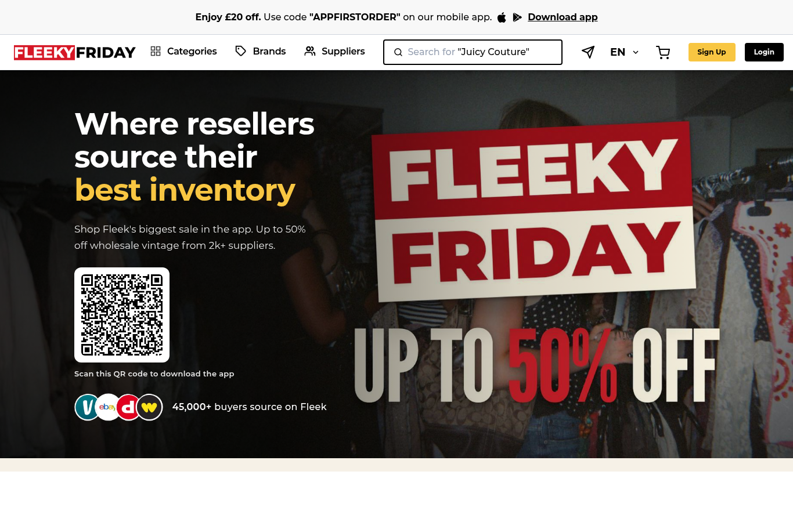
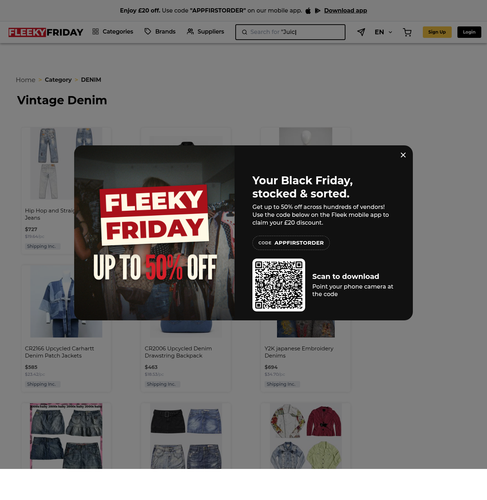

# Visual guide

Reference captures (joinfleek.com, accessed 7 October 2026):

| Capture | What it shows |
|---|---|
|  | Header layout, yellow/black buttons, hero accent colour |
|  | Mobile header: menu, logo, search full width |
|  | Breadcrumb, listing card anatomy (title, bold price, grey per-piece, grey tag) |

## Layout rules for the concept
- Desktop-first at 1280-1440 px: sticky header, then a cream band with the page title (one yellow phrase), then a three-column desk: supplier list (left, 300 px), sample inspection form and evidence (centre), decision panel with thresholds (right, 360 px). Decision log and export run full width below.
- Below 1100 px the right column drops under the centre; below 760 px everything stacks to one column, header search hides, logo 22 px.
- 8 px spacing grid (`--cf-sp-*`: 8/16/24/32/48). Max content width 1440 px.
- Cards: white, 1 px `#eaecf0`, radius 8 px, no heavy shadows (Fleek's cards are flat).
- Empty states: a short sentence of what to do next plus one button; error states list each problem with the row/field it came from.
- Focus rings: 2 px black outline offset 2 px; all hit targets at least 40 px.
